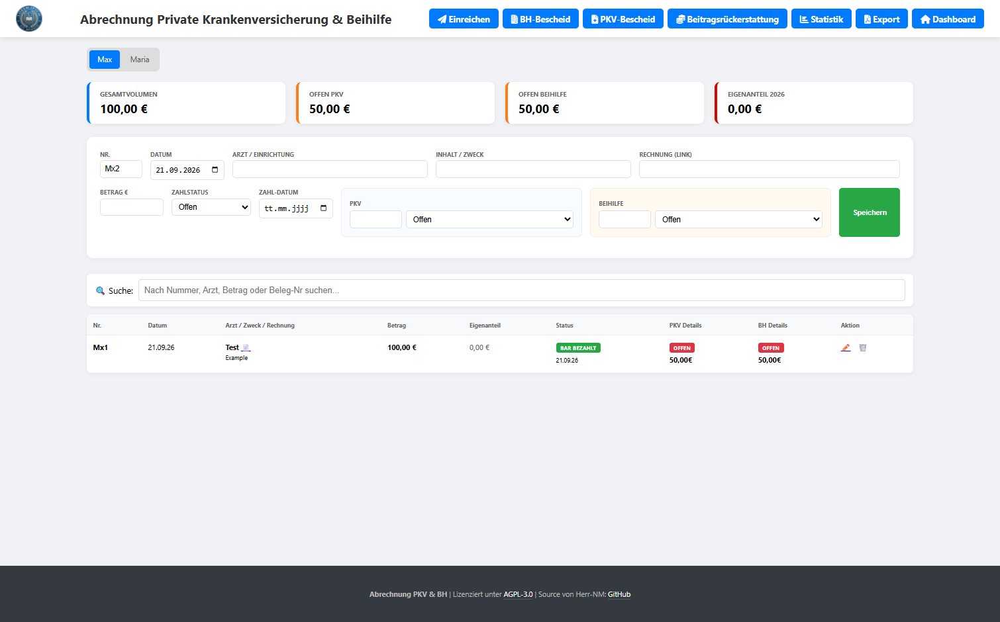
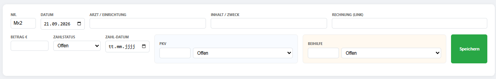
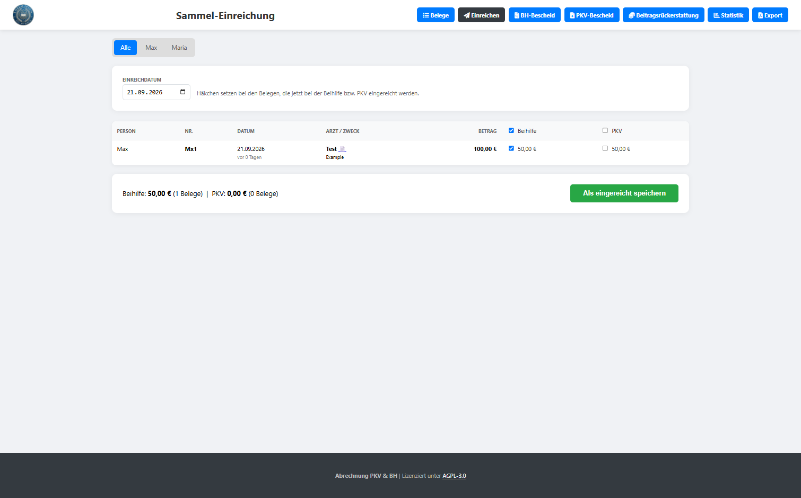
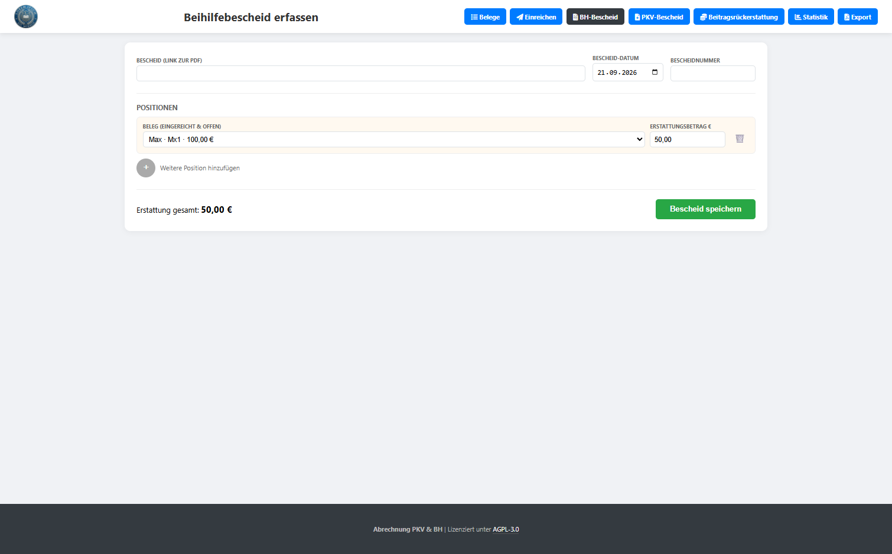
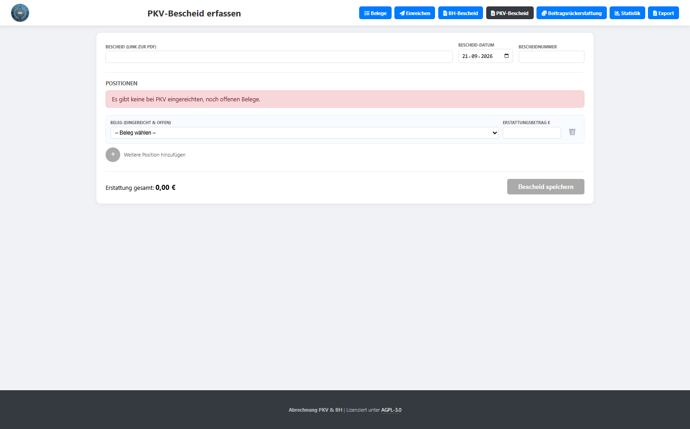
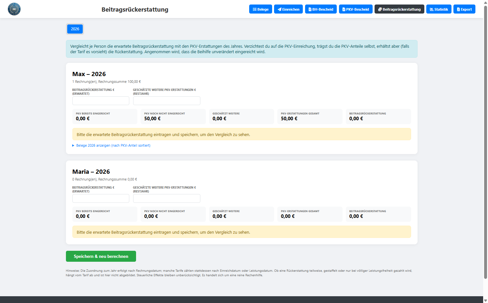
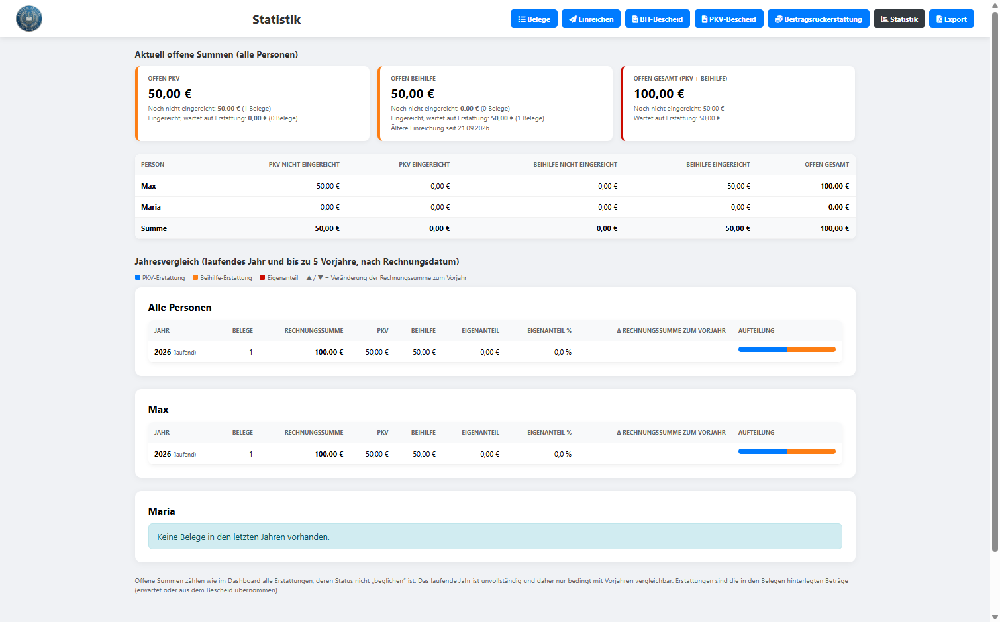
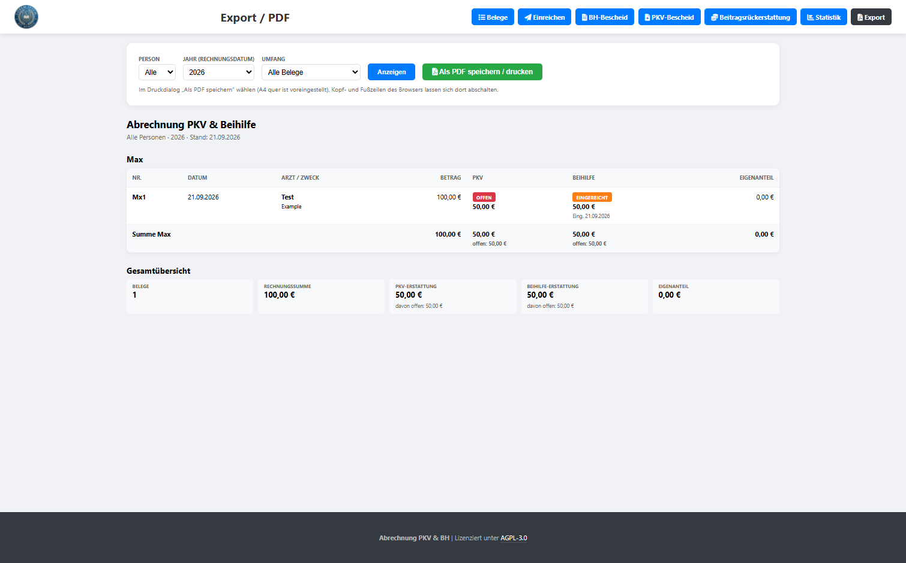

# Privat-Abrechnung PKV & Beihilfe

Ein schlankes, PHP-basiertes Tool zur Verwaltung von Arztrechnungen, Erstattungen der privaten Krankenversicherung (PKV) und der Beihilfe (BH). Die Anwendung ermöglicht es, Rechnungen zu erfassen, Zahlungs- und Einreichungsstatus zu überwachen, Bescheide zu erfassen und den Überblick über offene Erstattungen sowie den jährlichen Eigenanteil zu behalten.



## Features

- **Dashboard-Übersicht:** Direkter Blick auf Gesamtvolumen, getrennte offene Erstattungsbeträge (PKV & Beihilfe) und den aktuellen Eigenanteil des laufenden Jahres.
- **Profil-Verwaltung:** Unterstützung für mehrere Personen über eine `.env`-Konfiguration.
- **Automatisierte Berechnung:** Automatische Aufteilung des Rechnungsbetrags basierend auf individuellen Erstattungssätzen (z. B. 30 % PKV / 70 % Beihilfe).
- **Status-Tracking:** Verfolgung des Zahlungsstatus (offen, bezahlt, Terminüberweisung) sowie des Einreichungsstatus (offen, eingereicht, beglichen).
- **Sammel-Einreichung:** Mehrere Belege auf einmal als bei Beihilfe und/oder PKV eingereicht markieren.
- **Bescheid-Erfassung:** Eigene Masken für Beihilfe- und PKV-Bescheide. Ein Bescheid mit mehreren Positionen wird in einem Schritt erfasst und aktualisiert alle betroffenen Belege, auch personenübergreifend.
- **Beitragsrückerstattung:** Rechenhilfe, ob sich der Verzicht auf die PKV-Einreichung gegenüber den Erstattungen lohnt.
- **Statistik:** Offene Summen über alle Personen und Jahresvergleich je Person (laufendes Jahr und bis zu 5 Vorjahre).
- **PDF-Export:** Druckoptimierte Belegübersicht je Person und Jahr, als PDF speicherbar.
- **Dokumenten-Management:** Verlinkung von Rechnungs-PDFs und Erstattungsbescheiden direkt in der Tabelle.
- **Live-Suche:** Filtern der gesamten Tabelle nach Arzt, Zweck oder Belegnummer in Echtzeit.
- **Datenhaltung:** Speicherung in einer lokalen SQLite-Datei – kein Datenbankserver (MySQL etc.) erforderlich. Änderungen über mehrere Belege laufen in einer Transaktion.

## Voraussetzungen

- Webserver mit **PHP 8.x** (getestet mit Apache; `.htaccess`-Schutz setzt Apache 2.4 voraus)
- PHP-Erweiterung **`pdo_sqlite`** (bei den meisten Hostern aktiv; Prüfung: `php -m | grep -i sqlite`)
- Schreibrechte im Projektverzeichnis (für die Datenbankdatei `abrechnung.sqlite`)

## Dateien

| Datei | Zweck |
|---|---|
| `index.php` | Hauptansicht: Dashboard, Belege erfassen/bearbeiten/löschen, Tabelle mit Suche |
| `einreichung.php` | Sammel-Einreichung: mehrere Belege gleichzeitig als eingereicht markieren |
| `bescheid.php` | Erfassung eines **Beihilfebescheids** mit mehreren Positionen |
| `bescheid_pkv.php` | Erfassung eines **PKV-Bescheids** mit mehreren Positionen |
| `bescheid_form.php` | Gemeinsame Maske für die beiden Bescheid-Seiten (nicht direkt aufrufen) |
| `beitragsrueckerstattung.php` | Vergleich Beitragsrückerstattung vs. PKV-Erstattungen je Person und Jahr |
| `statistik.php` | Offene Summen und Jahresvergleich |
| `export.php` | Druck-/PDF-Ansicht der Belege |
| `common.php` | Gemeinsame Funktionen: `.env`, Datenbankzugriff, Seitengerüst (nicht direkt aufrufen) |
| `migrate.php` | Einmalige Übernahme alter JSON-Daten nach SQLite (danach löschen) |
| `.htaccess` | Zugriffsschutz für `.env`, Datenbank und Include-Dateien |
| `.env` | Profile der Personen und Erstattungssätze (selbst anlegen) |
| `abrechnung.sqlite` | Datenbank, wird beim ersten Aufruf automatisch angelegt |
| `logo.png` | Optional, wird im Seitenkopf angezeigt |

## Installation

1. **Dateien kopieren:** Lade alle `.php`-Dateien, die `.htaccess` und (optional) die `logo.png` in dasselbe Verzeichnis auf deinen Webserver. `migrate.php` wird nur bei einem Upgrade von der JSON-Version benötigt.
2. **Konfiguration:** Lege eine Datei `.env` im selben Verzeichnis an (siehe unten).
3. **Schreibrechte:** Das Verzeichnis muss für den Webserver-Benutzer beschreibbar sein, damit `abrechnung.sqlite` erstellt werden kann. Nach dem ersten Aufruf genügt Schreibzugriff auf die Datenbankdatei selbst.
4. **Erster Aufruf:** `index.php` im Browser öffnen. Tabellen werden automatisch angelegt.
5. **Zugriffsschutz prüfen:** Folgende Aufrufe müssen mit **403** antworten: `.env`, `abrechnung.sqlite`, `common.php`. Andernfalls greift die `.htaccess` nicht (siehe Abschnitt [Sicherheit](#sicherheit)).

### Upgrade von der JSON-Version

Frühere Versionen speicherten die Daten in `data_<person>.json`. So übernimmst du sie:

1. Sichere vorab das Verzeichnis (mindestens alle `data_*.json`).
2. Lade die neuen Dateien hoch, die `.env` bleibt unverändert.
3. Rufe `migrate.php` im Browser auf (oder per Kommandozeile: `php migrate.php`) und bestätige die Übernahme.
4. Prüfe die Daten in der Anwendung, auch Statistik und Beitragsrückerstattung.
5. Lösche danach `migrate.php` und verschiebe die `data_*.json` in ein Backup **außerhalb** des Webverzeichnisses.

Die Übernahme läuft in einer Transaktion (alles oder nichts), ändert die JSON-Dateien nicht und kann gefahrlos wiederholt werden; bereits vorhandene Belege werden nicht überschrieben.

## Konfiguration (.env)

In der `.env` Datei definierst du die Profile der Personen. Das Format ist:
`PERSON_ID=ID,Name,Präfix_RechnungsNr,PKV_Satz,BH_Satz`

**Beispiel:**
```env
PERSON_1=max,Max Mustermann,M,0.3,0.7
PERSON_2=erika,Erika Mustermann,E,0.5,0.5

# Optional: Pfad zur Datenbank (relativ zum Projektverzeichnis oder absolut)
# DB_FILE=abrechnung.sqlite
```
* `0.3` entspricht 30 % Erstattung durch die PKV.
* `0.7` entspricht 70 % Erstattung durch die Beihilfe.
* Die **ID** (`max`, `erika`) ist der Schlüssel, unter dem die Belege der Person in der Datenbank gespeichert werden. Sie sollte nachträglich nicht mehr geändert werden.
* Mit `DB_FILE` kannst du die Datenbank auch außerhalb des Webverzeichnisses ablegen, z. B. `DB_FILE=/var/lib/abrechnung/abrechnung.sqlite`.

## Nutzung

### Rechnungen erfassen
Geben Sie den Gesamtbetrag der Rechnung ein. Das Skript berechnet automatisch die erwarteten Anteile für PKV und Beihilfe. Sie können diese Beträge bei Bedarf manuell anpassen (z. B. wenn bestimmte Leistungen nicht erstattungsfähig sind).



### Status aktualisieren
Sobald Sie eine Rechnung eingereicht oder eine Erstattung erhalten haben, können Sie den Eintrag über das ✏️-Symbol bearbeiten. Das Dashboard aktualisiert sich sofort und zeigt Ihnen, welche Beträge noch ausstehen. Für mehrere Belege gleichzeitig gibt es die Sammel-Einreichung und die Bescheid-Erfassung (siehe unten).

### Sammel-Einreichung (`einreichung.php`)

Wenn du mehrere Rechnungen auf einmal bei Beihilfe und/oder PKV einreichst, musst du sie nicht einzeln bearbeiten:

1. Die Seite listet alle Belege, bei denen mindestens eine Stelle noch auf „offen“ steht (ältester Beleg zuerst, mit Alter in Tagen). Über die Reiter lässt sich nach Person filtern.
2. Je Beleg gibt es ein Häkchen für Beihilfe und eines für PKV. Über die Kopfzeile wählst du eine ganze Spalte aus.
3. Lege das Einreichdatum fest (Standard: heute). Unten siehst du die Summen der gewählten Erstattungen.
4. Mit „Als eingereicht speichern“ werden alle gewählten Häkchen in einer Transaktion auf „eingereicht“ gesetzt und das Einreichdatum eingetragen.



### Bescheide erfassen (`bescheid.php` und `bescheid_pkv.php`)

Für den Eingang eines Bescheids gibt es zwei Seiten mit identischem Ablauf: `bescheid.php` für die Beihilfe und `bescheid_pkv.php` für die PKV.

1. **Kopfdaten eingeben:** Link zur Bescheid-PDF, Bescheid-Datum (Standard: heute) und Bescheidnummer.
2. **Position wählen:** Im Dropdown erscheinen alle Belege **aller Personen**, die bei der jeweiligen Stelle den Status „eingereicht“ haben, mit Person, interner Nummer und Rechnungsbetrag, z. B. `Max Mustermann · M12 · 120,00 €`.
3. **Erstattungsbetrag prüfen:** Der erwartete Betrag ist vorbelegt, es müssen nur Abweichungen erfasst werden. Manuell geänderte Beträge bleiben beim Wechsel des Belegs erhalten.
4. **Weitere Positionen:** Über das **+** kommt eine Position dazu, über das 🗑️ wird sie entfernt. Bereits gewählte Belege sind in den anderen Dropdowns gesperrt.
5. **Speichern:** Erst nach der Sicherheitsabfrage werden alle Belege gemeinsam aktualisiert.





**Was beim Speichern geändert wird** (je Position):

| Feld Beihilfe | Feld PKV | Neuer Wert |
|---|---|---|
| `e_bh` | `e_pkv` | tatsächlicher Erstattungsbetrag aus dem Bescheid |
| `s_bh` | `s_pkv` | `beglichen` |
| `bh_date` | `pkv_date` | Bescheid-Datum |
| `bh_belegnr` | `pkv_belegnr` | Bescheidnummer |
| `bh_link` | `pkv_link` | Link zur Bescheid-PDF |

Das Einreichdatum (`bh_sub_date` / `pkv_sub_date`) bleibt unverändert.

**Sicherheitsprüfungen:** Innerhalb der Transaktion wird geprüft, ob jeder Beleg noch den Status „eingereicht“ hat, ob kein Beleg doppelt vorkommt und ob die Beträge gültig sind. Tritt ein Fehler auf, wird nichts geändert und die Eingaben bleiben im Formular stehen.

**Hinweise:**
- Der berechnete Erstattungsbetrag wird durch den tatsächlichen Betrag aus dem Bescheid überschrieben, damit Dashboard und Eigenanteil korrekt sind.
- Belege mit Status „offen“ (noch nicht eingereicht) erscheinen nicht im Dropdown. Sie müssen zuvor eingereicht werden, einzeln über ✏️ oder gesammelt über die Sammel-Einreichung.
- Beihilfe und PKV sind voneinander unabhängig: Ein Beleg kann bei der einen Stelle bereits beglichen und bei der anderen noch offen sein.
- Ein Beleg mit erwartetem Betrag `0,00` wird ebenfalls mit `0,00` vorbelegt; diesen Wert vor dem Speichern bitte prüfen.

### Beitragsrückerstattung (`beitragsrueckerstattung.php`)

Viele PKV-Tarife zahlen eine Beitragsrückerstattung, wenn im Kalenderjahr keine Leistungen eingereicht werden. Die Seite vergleicht je Person und Jahr:

- die **erwartete Beitragsrückerstattung** (von dir eingetragen),
- die **PKV-Erstattungen** des Jahres: bereits eingereicht, noch nicht eingereicht und optional geschätzte weitere Erstattungen bis Jahresende.

Das Ergebnis zeigt, ob der Verzicht auf die PKV-Einreichung rechnerisch günstiger ist, und um wie viel. Wurde für das Jahr schon etwas bei der PKV eingereicht, erscheint ein Warnhinweis, weil die Rückerstattung je nach Tarif dann bereits entfallen sein kann.

Annahmen: Zuordnung zum Jahr nach Rechnungsdatum, die Beihilfe wird unverändert eingereicht, Staffelungen oder Teilrückerstattungen und steuerliche Effekte sind nicht abgebildet. Es handelt sich um eine reine Rechenhilfe; maßgeblich sind die Tarifbedingungen.



### Statistik (`statistik.php`)

- **Aktuell offene Summen** über alle Personen: PKV, Beihilfe und gesamt, jeweils getrennt nach „noch nicht eingereicht“ und „eingereicht, wartet auf Erstattung“, dazu eine Tabelle je Person.
- **Jahresvergleich** für alle Personen zusammen und je Person: Belege, Rechnungssumme, PKV, Beihilfe, Eigenanteil (€ und %), Veränderung zum Vorjahr und ein Balken für die Aufteilung. Angezeigt werden das laufende Jahr und bis zu fünf Vorjahre, sofern Daten vorhanden sind, dazu der Durchschnitt der Vorjahre.



### Export als PDF (`export.php`)

Wähle Person, Jahr (oder alle Jahre) und Umfang (alle Belege oder nur mit offener Erstattung) und klicke auf „Als PDF speichern / drucken“. Im Druckdialog des Browsers wählst du „Als PDF speichern“ (A4 quer ist voreingestellt; Kopf- und Fußzeilen des Browsers lassen sich dort abschalten). Der Bericht enthält je Person eine Belegtabelle mit PKV- und Beihilfe-Status, Bescheidnummern, Zwischensummen und eine Gesamtübersicht. Der Export benötigt keine zusätzliche PHP-Bibliothek.



### Dashboard-Logik
- **Offen PKV/BH:** Summiert alle Beträge, deren Status nicht auf „beglichen“ steht.
- **Eigenanteil:** Berechnet sich aus `Gesamtbetrag - (PKV_Erstattung + BH_Erstattung)` für alle Rechnungen des aktuellen Kalenderjahres.

### Links zu den Dokumenten

Wenn die Dokumente digital vorgehalten werden, können Links zu diesen hinterlegt und später in der Web-Ansicht aufgerufen werden. Ich nutze dazu Paperless-ngx, in dem die PDF-Dateien der Rechnungen, der Beihilfebescheide sowie der Leistungsnachweise der PKV enthalten sind. Die Links zu den Bescheiden werden über die Bescheid-Seiten hinterlegt und erscheinen anschließend in der Tabelle von `index.php` als „📥 Bescheid“.

## Datenbank

Alle Daten liegen in einer SQLite-Datei (Standard: `abrechnung.sqlite`). Die Tabellen werden beim ersten Aufruf automatisch angelegt.

**Tabelle `belege`** (eine Zeile je Rechnung, `person` verweist auf die ID aus der `.env`):

| Spalte | Bedeutung |
|---|---|
| `id`, `person` | eindeutige Beleg-ID, Person-ID aus der `.env` |
| `intern_nr`, `rg_datum`, `arzt`, `beschreibung`, `doc_link`, `gesamt` | Rechnungsdaten und Link zur Rechnung |
| `z_status`, `z_datum` | Zahlstatus (offen, bar bezahlt, Terminüberweisung, Überweisung) und Zahldatum |
| `s_pkv`, `e_pkv`, `pkv_sub_date`, `pkv_date`, `pkv_belegnr`, `pkv_link` | PKV: Status, Erstattungsbetrag, Einreich- und Bescheiddatum, Bescheidnummer, Link |
| `s_bh`, `e_bh`, `bh_sub_date`, `bh_date`, `bh_belegnr`, `bh_link` | Beihilfe: dieselben Felder |

**Tabelle `bre`:** erwartete Beitragsrückerstattung und geschätzte weitere Erstattungen je Jahr und Person.

### Backup

Die Datenbank ist eine einzelne Datei. Für ein konsistentes Backup im laufenden Betrieb:

```bash
sqlite3 abrechnung.sqlite ".backup 'backup-$(date +%F).sqlite'"
```

Alternativ die Datei bei ruhender Anwendung kopieren. Backups gehören außerhalb des Webverzeichnisses abgelegt. Zum Ansehen und Bearbeiten eignet sich z. B. [DB Browser for SQLite](https://sqlitebrowser.org/).

## Sicherheit

Die Anwendung verarbeitet Gesundheits- und Abrechnungsdaten. Bitte beachten:

- **`.htaccess`:** Sie sperrt `.env`, `*.sqlite`, alte `data_*.json` und die Include-Dateien und verhindert Verzeichnislisting. Teste nach der Installation, dass `.env` und `abrechnung.sqlite` per Browser **403** liefern. Die `.htaccess` wirkt nur, wenn der Server sie erlaubt (`AllowOverride`).
- **Passwortschutz:** In der `.htaccess` ist ein optionaler Basic-Auth-Block vorbereitet (auskommentiert). Ohne Schutz sollte die Anwendung nicht öffentlich erreichbar sein.
- **Besser außerhalb des Webroots:** Mit `DB_FILE` in der `.env` lässt sich die Datenbank außerhalb des Webverzeichnisses ablegen.
- **nginx:** `.htaccess` wird ignoriert. Sperre dort per `location`-Blöcken (`deny all`) `.env`, `*.sqlite*`, `common.php` und `bescheid_form.php`.
- **Screenshots und Bugreports:** Keine echten Daten veröffentlichen.

## Technische Details

- **Sprache:** PHP 8.x
- **Datenbank:** SQLite über PDO (`pdo_sqlite`), Schreibvorgänge über mehrere Belege in Transaktionen
- **Frontend:** HTML5, CSS3 (Flexbox/Grid), JavaScript (Vanilla)
- **Icons:** FontAwesome 6.0 (via CDN)
- **Export:** Druckansicht des Browsers (Speichern als PDF)

## Lizenz

Dieses Projekt ist unter der **GNU AGPL-3.0** lizenziert. Weitere Details findest du im GitHub-Repository.

---

**Source:** [herr-nm/Privat_Abrechnung_PKV_Beihilfe](https://github.com/herr-nm/Privat_Abrechnung_PKV_Beihilfe)
