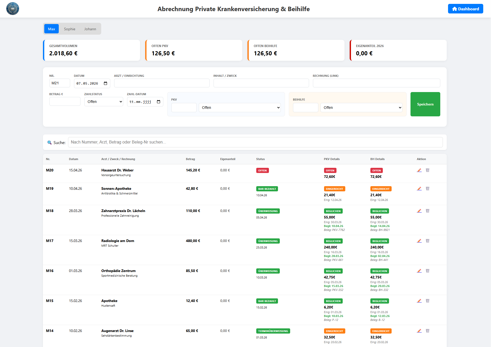

# Privat-Abrechnung PKV & Beihilfe

Ein schlankes, PHP-basiertes Tool zur Verwaltung von Arztrechnungen, Erstattungen der privaten Krankenversicherung (PKV) und der Beihilfe (BH). Die Anwendung ermöglicht es, Rechnungen zu erfassen, Zahlungsstatus zu überwachen und den Überblick über offene Erstattungen sowie den jährlichen Eigenanteil zu behalten.

## Features

- **Dashboard-Übersicht:** Direkter Blick auf Gesamtvolumen, getrennte offene Erstattungsbeträge (PKV & Beihilfe) und den aktuellen Eigenanteil des laufenden Jahres.
- **Profil-Verwaltung:** Unterstützung für mehrere Personen über eine `.env`-Konfiguration.
- **Automatisierte Berechnung:** Automatische Aufteilung des Rechnungsbetrags basierend auf individuellen Erstattungssätzen (z. B. 30% PKV / 70% Beihilfe).
- **Status-Tracking:** Verfolgung des Zahlungsstatus (offen, bezahlt, Terminüberweisung) sowie des Einreichungsstatus (eingereicht, beglichen).
- **Dokumenten-Management:** Verlinkung von Rechnungs-PDFs und Erstattungsbescheiden direkt in der Tabelle.
- **Live-Suche:** Filtern der gesamten Tabelle nach Arzt, Zweck oder Belegnummer in Echtzeit.
- **Datenhaltung:** Speicherung in lokalen JSON-Dateien – keine Datenbank (MySQL etc.) erforderlich.

## Screenshots



## Installation

1. **Dateien kopieren:** Lade die `index.php` und die `logo.png` (optional) auf deinen Webserver (z. B. Apache mit PHP-Unterstützung).
2. **Konfiguration:** Erstelle eine Datei namens `.env` im Hauptverzeichnis.
3. **Schreibrechte:** Stelle sicher, dass das Skript Schreibrechte im Verzeichnis hat, um die `data_*.json` Dateien zu erstellen.

## Konfiguration (.env)

In der `.env` Datei definierst du die Profile der Personen. Das Format ist:
`PERSON_ID=ID,Name,Präfix_RechnungsNr,PKV_Satz,BH_Satz`

**Beispiel:**
```env
PERSON_1=max,Max Mustermann,M,0.3,0.7
PERSON_2=erika,Erika Mustermann,E,0.5,0.5
```
* `0.3` entspricht 30% Erstattung durch die PKV.
* `0.7` entspricht 70% Erstattung durch die Beihilfe.

## Nutzung

### Rechnungen erfassen
Geben Sie den Gesamtbetrag der Rechnung ein. Das Skript berechnet automatisch die erwarteten Anteile für PKV und Beihilfe. Sie können diese Beträge bei Bedarf manuell anpassen (z. B. wenn bestimmte Leistungen nicht erstattungsfähig sind).

### Status aktualisieren
Sobald Sie eine Rechnung eingereicht oder eine Erstattung erhalten haben, können Sie den Eintrag über das ✏️-Symbol bearbeiten. Das Dashboard aktualisiert sich sofort und zeigt Ihnen, welche Beträge noch ausstehen.

### Dashboard-Logik
- **Offen PKV/BH:** Summiert alle Beträge, deren Status nicht auf "beglichen" steht.
- **Eigenanteil:** Berechnet sich aus `Gesamtbetrag - (PKV_Erstattung + BH_Erstattung)` für alle Rechnungen des aktuellen Kalenderjahres.

### Links zu den Dokumenten

Wenn die Dokumente digital vorgehalten werden, können Links zu diesen hinterlegt und später in der Web-Ansicht aufgerufen werden. Ich nutze dazu ein Paperless ndx, in dem die PDF-Dateien der Rechnungen, der Beihilfebescheide sowie der Leistungsnachweise der PKV enthalten sind.

## Technische Details

- **Sprache:** PHP 8.x
- **Frontend:** HTML5, CSS3 (Flexbox/Grid), JavaScript (Vanilla)
- **Icons:** FontAwesome 6.0 (via CDN)
- **Datenformat:** JSON

## Lizenz

Dieses Projekt ist unter der **GNU AGPL-3.0** lizenziert. Weitere Details findest du im GitHub-Repository.

---

**Source:** [herr-nm/Privat_Abrechnung_PKV_Beihilfe](https://github.com/herr-nm/Privat_Abrechnung_PKV_Beihilfe)